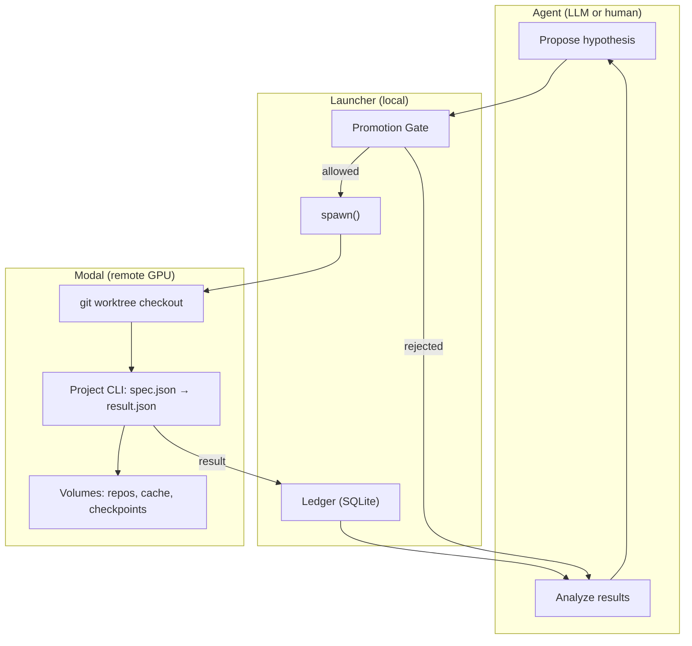
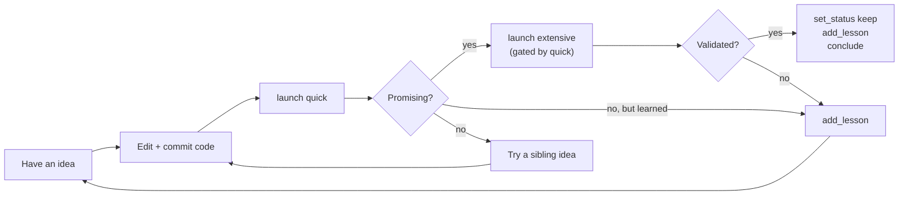
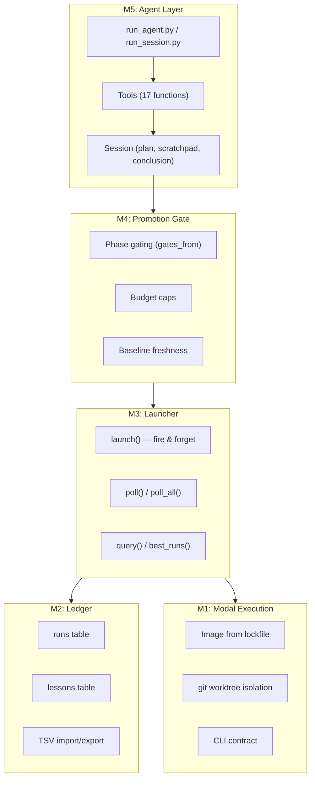
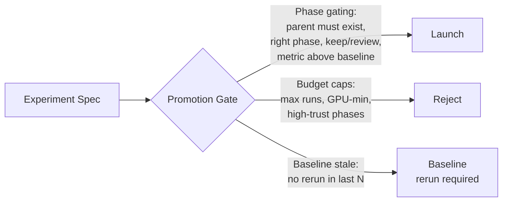

# modal-autoresearch

Project-agnostic ML autoresearch on [Modal](https://modal.com). An LLM agent proposes experiments, runs them on Modal GPUs, records results in a structured ledger, and iterates — capable of running unattended overnight.

Any ML project can plug in by providing a small manifest (`autoresearch.toml`) and a CLI entrypoint. The framework handles image building, experiment isolation, result tracking, promotion gates, and the agent loop.

## How it works



## Quick start

```bash
git clone https://github.com/approximatelylinear/modal-autoresearch
cd modal-autoresearch

# One-shot setup: installs deps, authenticates Modal, configures API key
./setup.sh --project ../your-project

# Or manually:
uv sync
uv run modal token new
echo "OPENAI_API_KEY=sk-..." > .env
```

Then run:

```bash
# Interactive session (human at the keyboard)
uv run python run_session.py --import-tsv ../your-project/results.tsv

# LLM agent with approval gates
uv run python run_agent.py --hitl --import-tsv ../your-project/results.tsv

# Fully autonomous (agent self-terminates via conclude())
uv run python run_agent.py --max-gpu-min 300 --max-runs 50
```

## From hypothesis to finished result

The framework is a substrate for iteration — it doesn't write code or invent ideas. Here is the typical end-to-end flow when you have an idea you want to test.

### 1. Implement the idea in your project

Modify your project's source, test it locally, commit. The commit SHA is your unit of reproducibility.

```bash
cd ../your-project
# Edit relevant files (e.g. add a new conditioning mechanism)
git commit -am "Add LoRA option to FiLM head"
git rev-parse HEAD          # → 7f3a91c... (your commit SHA)
```

The autoresearch CLI (`your_project/autoresearch.py`, the spec→result entrypoint declared in your manifest) is overlaid from the live working tree onto every run. So you don't have to commit CLI-only changes between runs — only experiment code is commit-pinned.

### 2. Launch a cheap-phase run

Always start with the lowest-trust phase. Either drive it yourself at the REPL:

```bash
uv run python run_session.py
> launch 7f3a91c quick "LoRA on FiLM reduces overfitting on scifact"
> wait <run-id>
```

…or let the LLM agent decide what to try given current ledger state:

```bash
uv run python run_agent.py --hitl   # you approve each launch
```

In agent mode, the agent first calls `set_plan(...)` to declare what it's investigating, then drives the loop itself.

### 3. Inspect, decide, curate

When a run finishes, look at the metrics and tag it. The ledger uses this curation downstream:

```
> set_status <run-id> keep "scifact +0.003, fiqa +0.001 — small but consistent"
```

Statuses: **keep** (promotable), **discard** (don't promote), **review** (revisit later). Always include a one-line `note` explaining *why* — that note becomes the searchable history.

### 4. Promote, or pivot

If the cheap-phase result is promising, promote it to a higher-trust phase. The promotion gate enforces this — you can't run `extensive` without a passing `quick` parent:

```
> launch 7f3a91c extensive "validate LoRA at scale" parent_run_id=<run-id>
```

If it's not promising, pivot. Tweak `config_overrides`, try a sibling commit, or try a different angle entirely.

### 5. Capture lessons

When a pattern shows up across multiple runs, record it as a **lesson** so future sessions don't relitigate the same ground:

```
> add_lesson "LoRA rank>16 hurts quick-phase scifact (evidence: <a>, <b>, <c>)"
```

Lessons live in a separate table from runs and are surfaced in every session's context.

### 6. Conclude

A session ends when the agent (or you) has reached an answer. In agent mode this is an explicit tool call:

```python
conclude(
    summary=(
        "Investigated LoRA on FiLM head. Quick: marginal +0.003 avg_ndcg10 "
        "(runs <a>, <b>); extensive: did not promote (run <c>: -0.001). "
        "Stopping — the effect is too small to justify the added params."
    ),
    lessons=[
        "LoRA rank>16 hurts quick-phase scifact",
        "Quick gains < 0.005 avg_ndcg10 typically don't survive extensive",
    ],
)
```

A "finished" result is the combination of: a kept run at a high-trust phase + a recorded conclusion + lessons that survive into future sessions.

### What "iteration" looks like in practice



The loop closes when you've answered the question your `set_plan` posed — or when continued pushing isn't going to teach you more in this session. The ledger persists across sessions, so tomorrow's session starts with everything today's session learned.

## Architecture



| Layer | What it does |
|-------|-------------|
| **M1 — Run Phase** | Builds Modal images from lockfiles, checks out commits via git worktrees, invokes project CLIs, captures provenance (image_hash, commit SHA) |
| **M2 — Ledger** | SQLite with runs + lessons tables. Metrics stored as JSON with denormalized primary_metric for ranking. TSV round-trip validated. |
| **M3 — Launcher** | Fire-and-forget `launch()`, non-blocking `poll()`, parallel sweeps. Local orchestration over Modal functions. |
| **M4 — Promotion Gate** | Phase gating from manifest, session budget caps, baseline freshness checks. Enforced in the launcher, not trusted to the agent. |
| **M5 — Agent loop** | Agent-driven session: explicit plan, in-session scratchpad, and `conclude()` self-termination. The loop runs until the agent concludes (or a safety stop trips), not until a fixed turn count. 17 tools with OpenAI function-calling schemas, interactive REPL, external-stop wrap-up. |

## Making a project autoresearchable

Any ML project can plug into the framework by providing two files:

### `autoresearch.toml`

```toml
[project]
name = "my-project"
description = "What this project does"

[environment]
python = "3.10"
lockfile = "uv.lock"

[entrypoint]
command = ["python", "-m", "my_project.autoresearch"]
default_gpu = "A10G"

# Define validation phases with promotion gates
[[phases]]
name = "smoke"
trust = "low"
typical_runtime_min = 5

[[phases]]
name = "full"
trust = "high"
gates_from = ["smoke"]    # requires a passing smoke run first
typical_runtime_min = 60

# Declare your metrics
[metrics]
primary = "val_loss"
higher_is_better = false
columns = [
    { name = "val_loss", type = "float" },
    { name = "val_accuracy", type = "float" },
]

# Reference run for substrate drift detection
[baseline]
commit_sha = "abc1234"
phase = "smoke"
[baseline.expected]
val_loss = 0.42
tolerance = 0.01
```

### CLI entrypoint

The launcher shells out to this inside the Modal container — it never imports your code as a library.

```
describe           → JSON config schema (what overrides are valid)
run --spec X --output Y  → reads spec JSON, runs experiment, writes result JSON
```

**Spec (input):**
```json
{
  "run_id": "...",
  "phase": "smoke",
  "commit_sha": "abc1234",
  "config_overrides": {"lr": 1e-4},
  "checkpoint_dir": "/cache/checkpoints/...",
  "log_dir": "/cache/logs/..."
}
```

**Result (output):**
```json
{
  "run_id": "...",
  "status": "ok",
  "metrics": {"val_loss": 0.38, "val_accuracy": 0.91},
  "cost": {"gpu_seconds": 312}
}
```

## Agent tools

The LLM agent (or human at the REPL) interacts through 17 tools, grouped by purpose:

| Category | Tool | What it does |
|----------|------|-------------|
| **Plan & lifecycle** | `set_plan` | Declare the session's goal, hypotheses, success criteria — surfaced in `context()` every turn |
|  | `update_plan` | Revise the plan; `reason` is mandatory |
|  | `note` | Append to the in-session scratchpad (working memory) |
|  | `conclude` | End the session with a summary + durable lessons |
| **Experiments** | `launch` | Fire-and-forget experiment on Modal |
|  | `wait` | Block until a run completes (preferred over polling loops) |
|  | `poll` / `poll_all` | Non-blocking check for completed runs |
|  | `cancel` | Kill an in-flight run |
| **Inspection** | `context` | Full session state: plan, notes, top runs, recent runs, lessons, budget |
|  | `query` | Filter runs by phase / status / track |
|  | `best_runs` | Top N by primary metric |
|  | `describe` | Project's config schema (what overrides are valid) |
|  | `stats` | Session statistics |
|  | `check_stop` | Whether external stop conditions are met |
| **Curation** | `set_status` | Mark a run as keep / discard / review |
|  | `add_lesson` | Record a durable cross-session insight |

The agent owns pacing and termination. It calls `conclude()` when it's reached a defensible answer, hit a wall, or run out of useful things to try. The loop only force-exits if a safety backstop (`--max-turns`, default 100) trips.

## Promotion gate

The gate is the most important guardrail. It's enforced in the launcher, not trusted to the agent.



## Reproducibility

Every run is pinned on three axes:

| Axis | How |
|------|-----|
| **Code** | `commit_sha` via `git worktree` from a bare clone on a Modal Volume |
| **Deps** | `image_hash` — SHA-256 of `pip freeze`, content-addressed |
| **Config** | `config_json` — exact overrides stored in the ledger |

The autoresearch CLI is overlaid from the live working tree onto each worktree after checkout — experiment code is commit-pinned, but the CLI infrastructure always tracks latest.

## Running modes

**Interactive REPL (you drive):**
```bash
uv run python run_session.py --import-tsv results.tsv
# Type tool calls at the REPL: launch, wait, set_status, ...
```

**LLM with approval gates (you watch):**
```bash
uv run python run_agent.py --hitl
# Agent proposes; you approve/reject each launch with [y/N/stop]
```

**Fully autonomous (overnight):**
```bash
uv run python run_agent.py --max-gpu-min 300 --max-runs 50
# Agent declares a plan, runs experiments, iterates, calls conclude()
# when done. Exits cleanly on conclude() or when the GPU/run budget
# is exhausted. --max-turns (default 100) is a safety backstop only.
```

Both `run_agent.py` and `run_session.py` accept `--local` to use the local GPU instead of Modal.

## Project structure

```
autoresearch/
├── manifest.py      Load + validate autoresearch.toml
├── image.py         Build Modal image from manifest
├── run_phase.py     Generic Modal Function + worktree mechanics
├── local_runner.py  Local-GPU runner (mirrors Modal's spawn/get interface)
├── ledger.py        SQLite runs + lessons
├── launcher.py      Local orchestration (fire-and-forget launch, poll)
├── gate.py          Promotion gate (phase gating, budget, baseline)
├── session.py       Session lifecycle, plan/scratchpad/conclusion state
└── tools.py         17 agent-callable tools + OpenAI schemas

run_session.py       Interactive REPL
run_agent.py         LLM-driven agent loop, exits on conclude()
smoke_baseline.py    Substrate validation (eval-only)
replay_baseline.py   Full pipeline validation (training)
setup.sh             One-shot install (deps, Modal auth, API key)
```

## Status

Built and validated with [hydra](https://github.com/approximatelylinear/hydra) (hypernet-conditioned retrieval) as the first project:

- Substrate reproduction: exact match (scifact NDCG@10 = 0.6451)
- Full training pipeline: end-to-end on Modal T4
- Ledger: 99-row TSV round-trip with zero diffs
- Gate: 21 test cases across all rules
- Session + tools: 30 test cases
