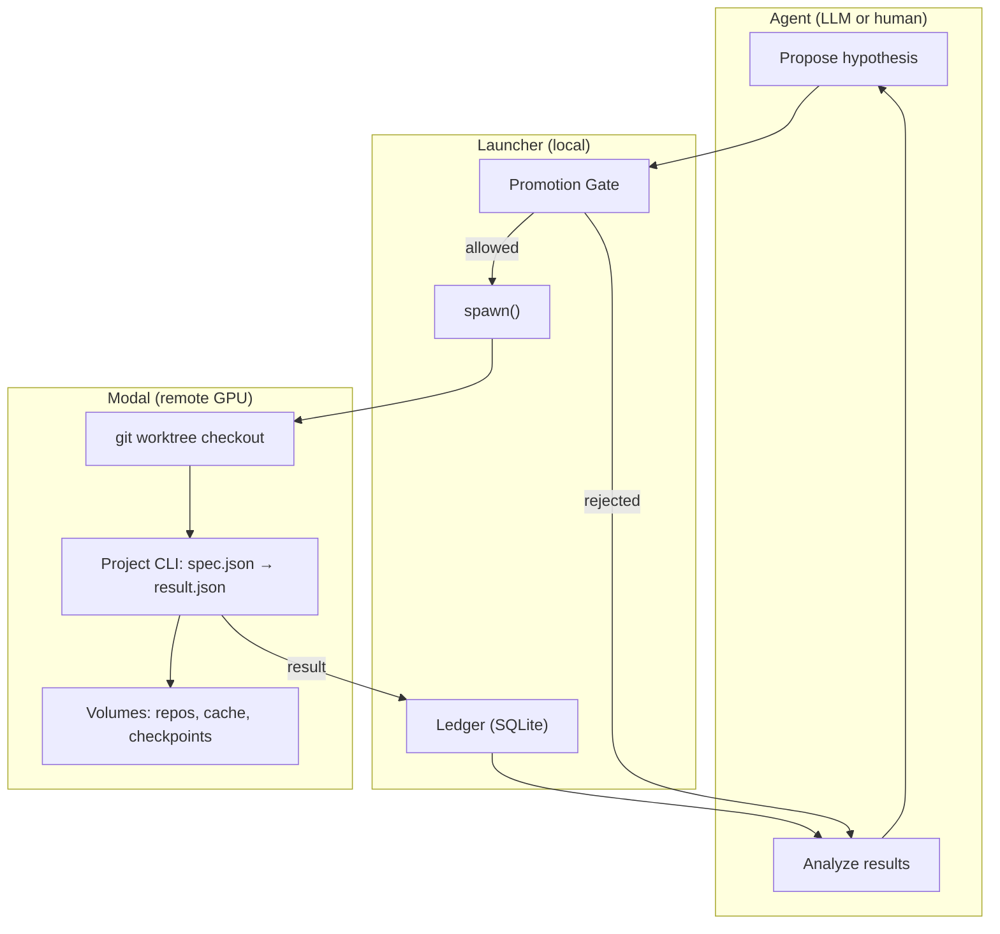
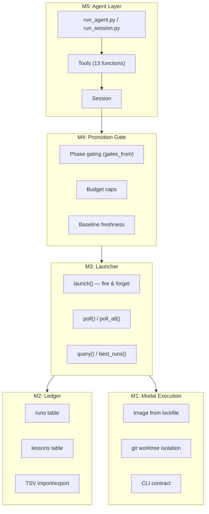
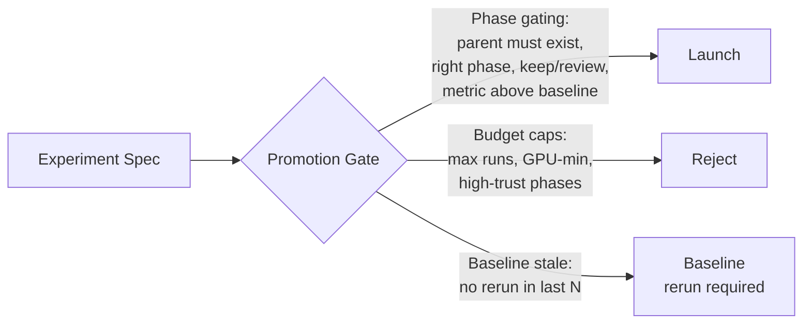

# modal-autoresearch

Project-agnostic ML autoresearch on [Modal](https://modal.com). An LLM agent proposes experiments, runs them on Modal GPUs, records results in a structured ledger, and iterates — capable of running unattended overnight.

Any ML project can plug in by providing a small manifest (`autoresearch.toml`) and a CLI entrypoint. The framework handles image building, experiment isolation, result tracking, promotion gates, and the agent loop.

## How it works



## Quick start

```bash
# Install
git clone https://github.com/approximatelylinear/modal-autoresearch
cd modal-autoresearch
uv sync

# Authenticate with Modal
uv run modal token new

# Interactive session (human at the keyboard)
uv run python run_session.py --import-tsv ../your-project/results.tsv

# LLM-driven session (requires .env with OPENAI_API_KEY)
echo "OPENAI_API_KEY=sk-..." > .env
uv run python run_agent.py --hitl --import-tsv ../your-project/results.tsv
```

## Architecture



| Layer | What it does |
|-------|-------------|
| **M1 — Run Phase** | Builds Modal images from lockfiles, checks out commits via git worktrees, invokes project CLIs, captures provenance (image_hash, commit SHA) |
| **M2 — Ledger** | SQLite with runs + lessons tables. Metrics stored as JSON with denormalized primary_metric for ranking. TSV round-trip validated. |
| **M3 — Launcher** | Fire-and-forget `launch()`, non-blocking `poll()`, parallel sweeps. Local orchestration over Modal functions. |
| **M4 — Promotion Gate** | Phase gating from manifest, session budget caps, baseline freshness checks. Enforced in the launcher, not trusted to the agent. |
| **M5 — Agent** | Session context building, LLM system prompt, 13 tool definitions with OpenAI function-calling schemas, interactive REPL, stop conditions. |

## Making a project autoresearchable

Any ML project can plug into the framework by providing two files:

### `autoresearch.toml`

```toml
[project]
name = "my-project"
description = "What this project does"

[environment]
python = "3.10"
lockfile = "uv.lock"

[entrypoint]
command = ["python", "-m", "my_project.autoresearch"]
default_gpu = "A10G"

# Define validation phases with promotion gates
[[phases]]
name = "smoke"
trust = "low"
typical_runtime_min = 5

[[phases]]
name = "full"
trust = "high"
gates_from = ["smoke"]    # requires a passing smoke run first
typical_runtime_min = 60

# Declare your metrics
[metrics]
primary = "val_loss"
higher_is_better = false
columns = [
    { name = "val_loss", type = "float" },
    { name = "val_accuracy", type = "float" },
]

# Reference run for substrate drift detection
[baseline]
commit_sha = "abc1234"
phase = "smoke"
[baseline.expected]
val_loss = 0.42
tolerance = 0.01
```

### CLI entrypoint

The launcher shells out to this inside the Modal container — it never imports your code as a library.

```
describe           → JSON config schema (what overrides are valid)
run --spec X --output Y  → reads spec JSON, runs experiment, writes result JSON
```

**Spec (input):**
```json
{
  "run_id": "...",
  "phase": "smoke",
  "commit_sha": "abc1234",
  "config_overrides": {"lr": 1e-4},
  "checkpoint_dir": "/cache/checkpoints/...",
  "log_dir": "/cache/logs/..."
}
```

**Result (output):**
```json
{
  "run_id": "...",
  "status": "ok",
  "metrics": {"val_loss": 0.38, "val_accuracy": 0.91},
  "cost": {"gpu_seconds": 312}
}
```

## Agent tools

The LLM agent (or human at the REPL) interacts through 13 tools:

| Tool | What it does |
|------|-------------|
| `launch` | Fire-and-forget experiment on Modal |
| `poll` / `poll_all` | Non-blocking check for completed runs |
| `wait` | Block until a run completes |
| `query` | Filter runs by phase / status / track |
| `best_runs` | Top N by primary metric |
| `set_status` | Mark a run as keep / discard / review |
| `add_lesson` | Record a meta-observation across runs |
| `cancel` | Kill an in-flight run |
| `context` | Session state summary for the agent |
| `describe` | Project's config schema |
| `stats` | Session statistics |
| `check_stop` | Whether stop conditions are met |

## Promotion gate

The gate is the most important guardrail. It's enforced in the launcher, not trusted to the agent.



## Reproducibility

Every run is pinned on three axes:

| Axis | How |
|------|-----|
| **Code** | `commit_sha` via `git worktree` from a bare clone on a Modal Volume |
| **Deps** | `image_hash` — SHA-256 of `pip freeze`, content-addressed |
| **Config** | `config_json` — exact overrides stored in the ledger |

The autoresearch CLI is overlaid from the live working tree onto each worktree after checkout — experiment code is commit-pinned, but the CLI infrastructure always tracks latest.

## Running modes

**Interactive (HITL):**
```bash
uv run python run_session.py --import-tsv results.tsv
# Type tool calls at the REPL
```

**LLM with approval gates:**
```bash
uv run python run_agent.py --hitl --max-turns 20
# Agent proposes, you approve/reject each launch
```

**Fully autonomous:**
```bash
uv run python run_agent.py --max-turns 50 --max-gpu-min 300
# Agent runs until budget or stop condition
```

## Project structure

```
autoresearch/
├── manifest.py     Load + validate autoresearch.toml
├── image.py        Build Modal image from manifest
├── run_phase.py    Generic Modal Function + worktree mechanics
├── ledger.py       SQLite runs + lessons
├── launcher.py     Local orchestration (fire-and-forget launch, poll)
├── gate.py         Promotion gate (phase gating, budget, baseline)
├── session.py      Session lifecycle + context building
└── tools.py        13 agent-callable tools + OpenAI schemas

run_session.py      Interactive REPL
run_agent.py        LLM-driven agent loop (OpenAI function calling)
smoke_baseline.py   Substrate validation (eval-only)
replay_baseline.py  Full pipeline validation (training)
```

## Status

Built and validated with [hydra](https://github.com/approximatelylinear/hydra) (hypernet-conditioned retrieval) as the first project:

- Substrate reproduction: exact match (scifact NDCG@10 = 0.6451)
- Full training pipeline: end-to-end on Modal T4
- Ledger: 99-row TSV round-trip with zero diffs
- Gate: 21 test cases across all rules
- Session + tools: 30 test cases
